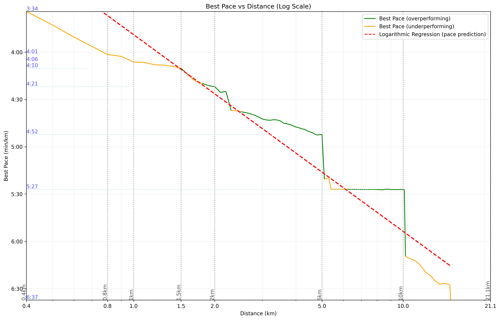

# Running Performance Analyzer

This repository contains a Python-based tool for analyzing running performance data from Strava. It fetches run data, calculates best paces across various distances, and provides visualizations to help runners understand their performance trends.

## Features

1. **Strava Data Fetching**: Retrieves detailed GPS data for runs from the Strava API.
2. **Best Pace Calculation**: Computes the best pace achieved for various distances, considering all possible sub-runs within each activity.
3. **Performance Trend Analysis**: Uses logarithmic regression to create a performance prediction curve.
4. **Visualization**: Generates a plot showing best paces vs. distances, with a color-coded curve indicating over- and under-performance relative to the prediction.

## How It Works

1. The script fetches run data from Strava and processes it to extract time and distance information.
2. It then calculates the best pace achieved for a range of distances (e.g., 400m to 15km).
3. A logarithmic regression is performed to create a "predicted performance" curve.
4. The results are visualized in a plot, where:
   - Green segments indicate distances where performance is better than predicted
   - Orange segments indicate distances where there's potential for improvement
   - Vertical and horizontal lines mark key distances and their corresponding paces

## Sample Output

This plot shows:
- Best achieved paces across different distances
- A regression curve predicting expected performance
- Color-coded segments indicating over- and under-performance
- Markers for standard race distances (400m, 800m, 1km, 5km, etc.)

## Usage

[Coming soon]

## Interpretation

- Green segments suggest distances where you're performing well relative to your overall fitness.
- Orange segments indicate distances where you might have room for improvement.
- The regression curve provides a baseline for expected performance across all distances.
- Use this information to identify strengths, weaknesses, and potential areas for focused training.

## Dependencies

- Python 3.x
- pandas
- numpy
- matplotlib
- requests (for API calls)

## More functionalities to come !
